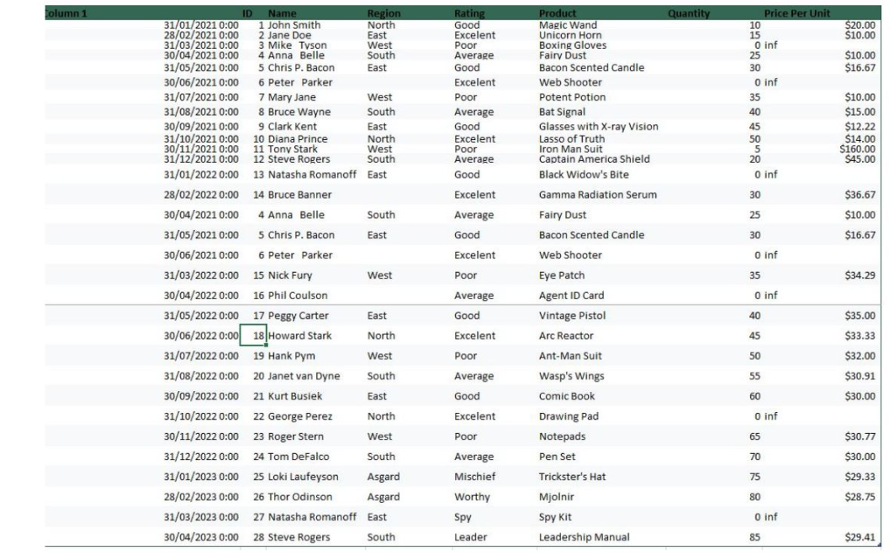

### Midterm Lab Task 1
This task is Data cleaning and preparation using Excel.
# STEP 1: Autofit Columns and Rows:
Select the entire worksheet and use the autofit feature to make columns and rows visible.
Keyboard shortcuts: CTRL+A to select all, ALT+H+O+I for column width, and ALT+H+O+A for row height.

# Step 2: Identify and Remove Duplicates:
Use conditional formatting to highlight duplicates, then remove them using the 'Remove Duplicates' feature under the Data tab.

# Step 3: Trim Extra Spaces:
Use the TRIM function to remove extra spaces from the data.
Apply the formula to the necessary columns and copy the cleaned data back into the original columns.

# Step 4: Eliminate Blank Cells:

Use the 'Go To Special' option to select and fill blank cells with a placeholder value or data from the cell above.

# Step 5; Spell Check:

Run a spell check on the selected columns to correct typos and misspellings.
Use the keyboard shortcut F7 to open the spell check dialog box.

# Step 6: Data Validation:

Set up data validation rules to enforce data integrity.

Create dropdown lists for specific columns to prevent future errors.

# Step 7: Handle Errors with IFERROR:

Use the IFERROR function to manage and display errors in the dataset.

Return a custom value or formula in place of error messages.

# Step 8: Number Formats:

Use plain number formats during the analysis phase to avoid unnecessary clutter.

Apply comma separators for large numbers and format dates as 'Short Date' if the time component is not needed.

# Step 9: Find & Replace:

Use the Find & Replace tool for bulk corrections to maintain data consistency.

Replace unwanted values, such as 'inf', with desired values or blank cells. 

# Sample output:

