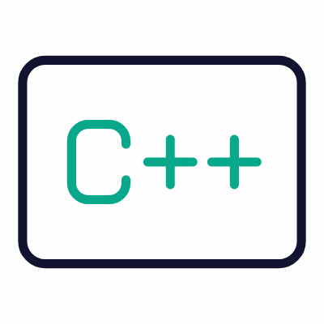
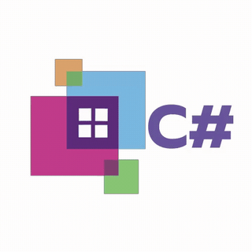

## EDM Projects – Lovell John P. Blanco 🎯📊
Welcome to my repository of projects! Here, I showcase my skills and passion for data analysis, cleaning, and transformation. 🚀✨

### About Me

Hi, I'm Lovell John P. Blanco 👋, a laid-back yet detail-oriented data enthusiast. My passion lies in transforming raw data into actionable insights. I specialize in data cleaning, analysis, and visualization, driven by a desire to make information meaningful and impactful. 💡📈

## Education 🎓
### College: City College of Angeles Bachelor of Science in Information Systems 
#### - Specialization in - Data Science and Analytics
  
###  High School: Sapang Bato National High School
###  Elementary: Sapang Bato Elementary School

## Skills & Interests 🚀🎨
### Skills:
- 🧹 Data cleaning and preparation
- 📊 Data analysis and visualization using Excel and Python
- 🟩 Proficient in Excel Power Query and data manipulation
- 🔄 Understanding of data normalization processes
  
    

### Interests:
- 🛠️ Exploring new data tools (like Jekyll for web development)
- 🌐 Static site generation using GitHub Pages
- 📘 Continuous learning in data science and analytics

## My Projects 💻📂
### 1. Midterm Lab Task 1: Data Cleaning and Preparation 🧹🛠️
- Description: In this project, I tackled a messy dataset filled with inconsistencies and missing values. I applied advanced data-cleaning techniques to prepare it for analysis.

- Tech Stack: 🐍 Python (Pandas, NumPy), 🟩 Excel Power Query

### Key Learnings:
- 🛠️ Data wrangling
- 🤔 Handling missing values
- 🔄 Data normalization techniques

### Task Midterm:
- 📋 [Cleaned Dataset (Excel)](https://pages.github.com/).
- 📖 [Data Cleaning Process Documentation](Midterm%20Task/image/Screenshot%20(1).png)
- 🖼️ [Power Query Transformation Screenshot](Midterm%20Task%202/image/Screenshot%20(5).png)
- 📂 [Uncleaned Dataset (CSV)](Midterm%20Task/Task/Blanco,%20Clean%20up.xlsx)
- 📊 [Dashboard](Midterm%20Task%203/image/Screenshot%20(12).png)

### Task Lastterm:
- 💾 [SQL](Task/SQL/Event%20Management.sql) [(Words)](Task/SQL/event%20management.docx)
- 🗂️ [Student assignment submission](Task/Student%20assignment%20submission/Dump20250414.sql) [(Words)](Task/Student%20assignment%20submission/Student%20assignment%20submission.docx)
- 💽 [Table Manipulation](Task/Table%20Manipulation/Dump20250414%20(1).sql) [(Words)](Task/Table%20Manipulation/Products%20and%20Prices.docx)
- 🖥️ SELECT statement [Part 1](Task/SELECT%20Statement/part%201.docx) [Part 2](Task/SELECT%20Statement/part%202.docx)
- 🖨️ [TASK 5 stored Procedures Views and Function](Task/Final%20Task%205/Finals%20Task%205.%20SQL%20Views%20FN%20and%20SPdocx.docx)
